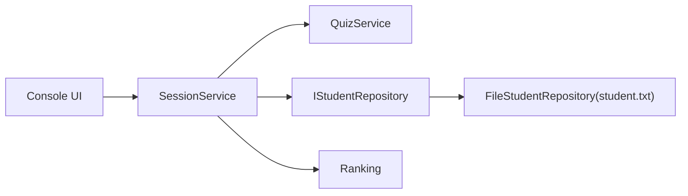

# MathHelperCpp

将课程设计《数学小帮手》重构为可面试展示的 C++ 工程化项目，聚焦 `Visual Studio 2026 + CMake + C++20`。

## 项目亮点

- 采用三层结构：`核心逻辑(Quiz/Ranking)` + `数据访问(Repository)` + `命令行交互(Session/UI)`。
- 保留原始业务能力：登录、分年级口算、应用题训练、排行榜、成绩持久化。
- 统一随机数入口（一次种子注入），消除循环内重复播种问题。
- 新增零依赖自测程序 `mathhelper_smoke`，用于快速回归核心规则。
- 数据格式兼容旧版 `student.txt`（`姓名\t年级\t分数`）。

## 目录结构

```text
MathHelperCpp
├── include/mathhelper
│   ├── app/session_service.h
│   ├── model/{student.h, ranking.h}
│   ├── quiz/{quiz_types.h, quiz_service.h}
│   ├── repository/{i_student_repository.h, file_student_repository.h}
│   └── ui/console_ui.h
├── src
│   ├── app/session_service.cpp
│   ├── model/ranking.cpp
│   ├── quiz/quiz_service.cpp
│   ├── repository/file_student_repository.cpp
│   ├── ui/console_ui.cpp
│   └── main.cpp
├── tests/smoke_main.cpp
├── docs/工程化设计说明.md
├── docs/简历项目描述模板.md
├── CMakeLists.txt
└── CMakePresets.json
```

## 架构概览



## 在 VS 2026 中构建与运行

1. 安装 Visual Studio 2026（包含“使用 C++ 的桌面开发”工作负载）和 CMake。
2. 用 VS 直接打开仓库根目录（CMake 项目）。
3. 选择配置预设（推荐优先选 Ninja，跨 VS 版本最稳）：
4. 启动目标：
   - 业务演示：`mathhelper_cli`
   - 自测回归：`mathhelper_smoke`

## 功能说明

- 登录：已注册用户仅输入姓名，首次登录用户需补充年级。
- 口算训练：按年级动态生成 10 题并自动判题，累计对题数。
- 应用题训练：六年级专属（正方形/长方形/三角形/圆形周长面积）。
- 排行榜：按累计得分降序展示，支持每页 5 人分页查看。
